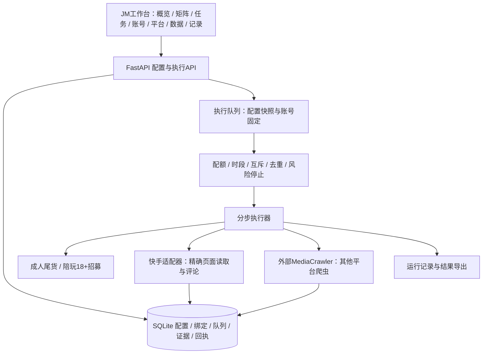
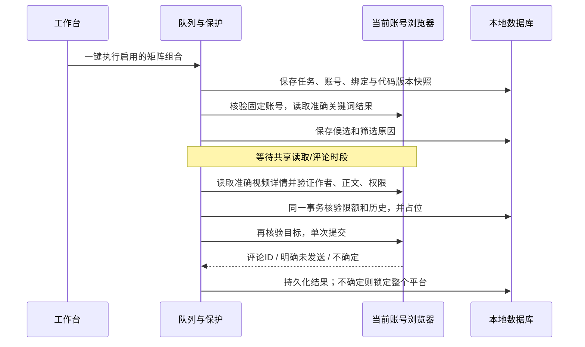

# JM工作台架构

## 目标
把平台、账号、业务、任务和结果分开管理，使新业务只增加规则、新平台只增加适配器。用户先配置矩阵，再一次执行选中的任务，无需逐条内容审核。

## 模块边界
| 目录 | 责任 | 不应包含 |
|---|---|---|
| core | 配置模型、数据库、平台注册表、任务状态 | 页面选择器 |
| adapters | 平台读取/发布、浏览器连接、外部爬虫进程 | 业务招募判断 |
| policies | 成人尾货、陪玩招募的自动判断及模板检查 | 网络与数据库写入 |
| services | 矩阵预检、排队、单步执行、去重/预算、迁移 | HTML |
| web | HTTP API、本地访问保护、静态界面 | 直接发平台评论 |
| tests | 单元、接口、场景、浏览器验收 | 真实评论请求 |

## 状态与一致性
- 任务定义可编辑，执行绑定由“任务×账号”确定；每次运行保存配置快照和版本。
- 新增/修改配置可用，但活动任务的旧快照不能被新配置静默替换。
- SQLite事务领取任务与占位，单个浏览器资料目录串行，平台共享请求/发送预算。
- 发送状态：reserved → sent / unknown / failed。未知结果不重试；重启恢复先处理悬挂占位。
- 爬虫状态：queued → running → completed / waiting / paused / failed。停止在下一个步骤前生效，已发请求不可撤销。
- 本机连接或未登录不等于平台封禁。平台限制锁定同平台任务，禁止自动换账号继续。

## 数据与部署
JM配置与结果放var下，不入Git；账号仅存本机资料目录及核验身份，不存明文密码/Cookie。历史库只读导入，原数据库不迁移位置。
MediaCrawler是可配置外部依赖，不捆绑上游源码。每次爬虫任务使用独立参数与输出目录，禁止修改外部共享配置。
工作台仅监听127.0.0.1，所有状态修改验证Origin和CSRF；生产与测试注入的适配器分开。

## 扩展新平台
1. 注册平台代码、名称、允许域名、已实现能力。
2. 实现读取/身份检查接口并建立真实固定样本测试。
3. 评论能力须额外验证精确目标、权限、回执和不确定状态，不随爬虫能力自动开启。
4. 在UI能力表中明确“可执行、依赖缺失、尚未接入”，不能使用假成功。

## 当前数据结构

| 表 | 用途 |
|---|---|
| objects | 账号、任务、矩阵绑定、迁移标记，独立版本号 |
| runs | 不可变配置快照、队列状态、进展、下次执行时间 |
| evidence | 原始读取字段、目标标识、筛选结论及依据 |
| attempts | 唯一视频发送占位、固定账号、内容、原始证据与回执 |
| history | 导入的历史接触，用于跨业务去重 |
| reads | 平台共享读取预算 |
| risk | 平台级限制，覆盖该平台所有账号 |
| events | 用户操作与执行步骤记录 |

## 评论执行顺序

## 后续迭代顺序

1. 为其他平台逐一补充已登录账号的有限读取样本与页面验收，记录适配器版本。
2. 增加标注过的真实正负样本回归集，先评估误投率，再调整业务规则；不因采集数量少就放宽证据要求。
3. 如需要视觉或语音理解，增加独立证据生产器，保留文本/视觉来源及置信度，不改变发送占位与去重边界。
4. 如扩展其他平台评论，先实现身份、准确目标、权限、回执和未知结果测试，再打开注册表能力。
5. 需要联网多人协同时再引入身份认证、权限、服务部署和数据库迁移方案；当前版本保留本机运行边界。
