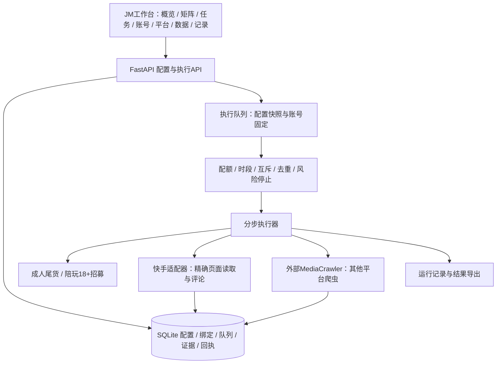
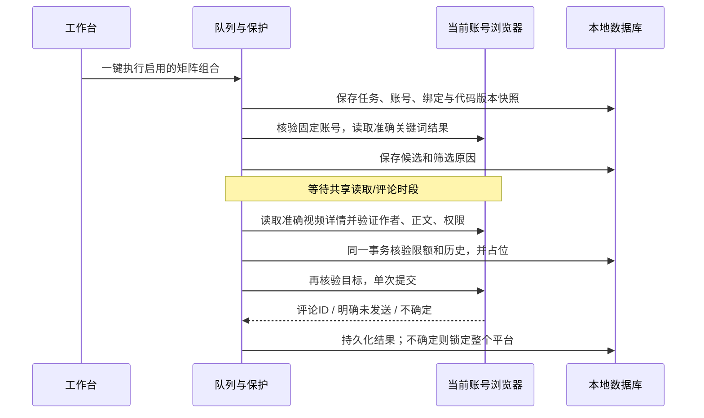

# JM工作台架构

## 目标
把平台、账号、业务、任务和结果分开管理，使新业务只增加规则、新平台只增加适配器。用户先配置矩阵，再一次执行选中的任务，无需逐条内容审核。

2026-09-30：主界面合并为任务、内容发布、数据、账号、设置。新增独立 `publishing` 域，通过本机 SAU 发布视频；与评论/爬虫复用浏览器互斥和平台风险锁，队列与回执单独保存。[详细边界、状态与维护](content-publishing.md)。

## 模块边界
| 目录 | 责任 | 不应包含 |
|---|---|---|
| core | 配置模型、数据库、平台注册表、任务状态 | 页面选择器 |
| adapters | 平台读取/发布、浏览器连接、外部爬虫进程 | 业务招募判断 |
| policies | 成人尾货、陪玩招募的自动判断及模板检查 | 网络与数据库写入 |
| services | 矩阵预检、排队、单步执行、去重/预算、迁移 | HTML |
| web | HTTP API、本地访问保护、静态界面 | 直接发平台评论 |
| tests | 单元、接口、场景、浏览器验收 | 真实评论请求 |

## 状态与一致性
- 任务定义可编辑，执行绑定由“任务×账号”确定；每次运行保存配置快照和版本。
- 新增/修改配置可用，但活动任务的旧快照不能被新配置静默替换。
- SQLite事务领取任务与占位，单个浏览器资料目录串行，平台共享请求/发送预算。
- 发送状态：reserved → sent / unknown / failed。未知结果不重试；重启恢复先处理悬挂占位。
- 爬虫状态：queued → running → completed / waiting / paused / failed。停止在下一个步骤前生效，已发请求不可撤销。
- 本机连接或未登录不等于平台封禁。平台限制锁定同平台任务，禁止自动换账号继续。

## 数据与部署
JM配置与结果放var下，不入Git；账号仅存本机资料目录及核验身份，不存明文密码/Cookie。历史库只读导入，原数据库不迁移位置。
MediaCrawler是可配置外部依赖，不捆绑上游源码。每次爬虫任务使用独立参数与输出目录，禁止修改外部共享配置。
工作台仅监听127.0.0.1，所有状态修改验证Origin和CSRF；生产与测试注入的适配器分开。

## 扩展新平台
1. 注册平台代码、名称、允许域名、已实现能力。
2. 实现读取/身份检查接口并建立真实固定样本测试。
3. 评论能力须额外验证精确目标、权限、回执和不确定状态，不随爬虫能力自动开启。
4. 在UI能力表中明确“可执行、依赖缺失、尚未接入”，不能使用假成功。

## 当前数据结构

`services/data_view.py`提供只读业务解释视图，计算分类、批次、去重、关键词来源和条件式评论预览；不改写原始evidence，也不生成发送许可。前端实现位于`web/static/data-page.js`和`data-page.css`，与发送执行器分开维护。

| 表 | 用途 |
|---|---|
| objects | 账号、任务、矩阵绑定、迁移标记，独立版本号 |
| runs | 不可变配置快照、队列状态、进展、下次执行时间 |
| evidence | 原始读取字段、目标标识、筛选结论及依据 |
| continuations | 原运行到补发运行的唯一关联，事务保证重复点击只建立一个队列 |
| attempts | 唯一视频发送占位、固定账号、内容、原始证据与回执 |
| history | 导入的历史接触，用于跨业务去重 |
| reads | 平台共享读取预算 |
| risk | 平台级限制，覆盖该平台所有账号 |
| events | 用户操作与执行步骤记录 |

## 评论执行顺序

成人业务的任务字段有三个范围：`inventory`要求货品线索；`merchant`允许正文确认的自家成人用品经营视频；用户当前选择的`keyword`只要求标题/正文与本次关键词的成人用品主题、店铺/库存等相关要素一致，相关报道、讨论、买家测评也可进入候选，不再要求店主身份或库存。三种范围都不接受单凭搜索命中、昵称或纯标签的判断；采集到的用户评论也不能充当视频正文。搜索、详情、事务占位、只读预览均读取任务自己的范围。旧配置没有该字段时沿用inventory。

关键词匹配由`policies/relevance.py`实现。搜索响应必须属于当前关键词；执行队列保存视频ID与来源关键词，重新读取详情后附上`search_origin`。详情和事务占位均核对来源视频ID与配置中的关键词，再重新判断当前正文；不能把另一个视频或旧关键词的来源套过来。类别同义词用于成人用品/情趣用品等表达，带“店”或库存处置要素的查询还需相应内容证据。此为文字规则匹配，尚未读取画面或口播，不能称为完整视频语义识别。

`comment_mode=templates`使用完整文案；`core_variants`由`policies/comments.py`围绕`comment_core`进行本机有限同义改写，不调用外部模型，不编造对方库存、经营状态或合作经历。每个准确视频ID稳定对应一条表达。去重拦截后不会另换一句重试。实际发送文本保存在attempts中，预览调用相同生成器。旧配置沿用templates；切换模式不会影响另一业务。

`POST /api/comment-preview`校验未保存的任务配置并返回示例，不写数据库、不创建任务或发送尝试。配置界面位于`web/static/comment-fields.js`；数据页显示保存后的范围、核心和示例。原历史判断保留，当前预览按新配置重新计算。

## 后续迭代顺序

1. 为其他平台逐一补充已登录账号的有限读取样本与页面验收，记录适配器版本。
2. 增加标注过的真实正负样本回归集，先评估误投率，再调整业务规则；不因采集数量少就放宽证据要求。
3. 如需要视觉或语音理解，增加独立证据生产器，保留文本/视觉来源及置信度，不改变发送占位与去重边界。
4. 如扩展其他平台评论，先实现身份、准确目标、权限、回执和未知结果测试，再打开注册表能力。
5. 需要联网多人协同时再引入身份认证、权限、服务部署和数据库迁移方案；当前版本保留本机运行边界。

## 每视频一条与剩余队列（2026-09-17）

- `comments_per_video=1`是每个准确视频的发送条数；数据库同时保证同平台视频唯一占位，历史接触永久排除。
- `publish_scope=all_matches`处理配置关键词返回的全部合格候选（每词仍受max_items限制），不因max_publish=1提前结束。显式选择limited才使用max_publish限制本任务处理的视频总数。旧持久化任务/快照缺字段时仍按limited执行；新建配置默认all_matches，界面编辑旧配置保留旧范围。
- 平台每日配额与任务总量分离：30分钟间隔、滚动24小时5次发送尝试、20–23时段仍生效。达到临时限额进入waiting，保留pending，服务重启后可继续等待。
- `contact_status`区分永久排除（已有视频接触）与临时等待（作者/文本7天）。pending中的not_before记录最早可处理时间；执行器先处理已经到期的视频，详情变化或权限缺失时跳过。等待时长不代表发布许可，到期仍重新核验固定账号、准确详情、正文、权限和事务占位。
- `services/continuation.py`实现`POST /api/runs/{id}/continue`：仅续接已完成/停止/失败运行的原pending，绑定原账号身份与资料目录，使用当前通过预检的同类业务配置。新队列不重新搜索，也不继续原任务尚未搜索的其他关键词。
- 原快照与发送记录不改；新运行记录source_run_id、selected_count、imported_count、skipped_targets，并复制原搜索证据（注明沿用、必须重读详情），允许中途停止后继续剩余目标。continuations唯一主键和事务避免重复点击产生多份任务。
- 运行记录分别显示采集、发布、待处理、跳过和逐视频等待原因；已有后续队列的原任务不再显示补发按钮。用户可停止新的队列。未知发送仍锁定平台，续接接口不能绕过风险锁或不确定回执。

## 历史批次复筛维护入口

`scripts/requeue_history.py`用于已经完成、pending为空的历史成人批次，默认只读预览，显式`--apply`才追加候选。它复用当前关键词正文规则与接触去重，不修改原运行、旧筛选结论或发送回执。可通过`python -m scripts.requeue_history <原运行ID>`预览。

仅允许合并到同一任务、同一账号、当前配置和代码版本完全一致且已结束搜索的等待补发队列；执行中的队列拒绝合并。原查询必须同时属于原任务与当前配置，准确视频/作者ID必须完整。对原批次视频去重，排除已接触或任何同平台活动队列里的视频；作者/文本间隔到期前保留等待。

`--apply`使用单个立即事务检查版本、平台限制与未知回执，保存新候选、继承证据、batch_rechecks审计信息和continuations来源关联，重复调用只返回已有队列。旧pending按原顺序保留，新候选追加；实际发送仍完全经过现有执行器。维护脚本不改变运行代码与冻结快照，避免为一次批次补发中断已经等待的任务。

## 后台服务守护（2026-09-18）

`scripts/service_watchdog.py`与业务包分离，`scripts/Manage-JMWatchdog.ps1`负责启用/禁用/查看本机Windows任务。当前用户Interactive/Limited运行，无凭据存储；登录触发和每分钟重复触发，IgnoreNew与文件锁双重防止多检查器，ExecutionTimeLimit=PT0S保持常驻。业务revision未改变，已有快照不失效。

检查器每30秒直连127.0.0.1健康入口（禁用代理），核对app_id、worker和预先确认的业务revision。正常只更新本机状态文件；仅在状态变化时记录日志。端口仍占用、健康内容异常、代码变更、数据库缺失、worker.lock仍锁定等情况不启动第二个执行器、不杀未知进程。确认为已停止时，以隐藏窗口启动原解释器和数据目录，验证健康回执；连续失败持久化退避，避免恢复风暴。

检查器不连接业务数据库、不调用业务写接口。排队恢复由现有Engine/recover负责：waiting/queued保留，running暂停，reserved变unknown并锁平台；守护不自动解除这些状态。维护停用标记独立于业务“停止任务”，业务停止不会被守护反转。日志滚动且不记录Cookie或账号信息，配置和运行状态仅在var。

Windows任务设置语义参考Microsoft官方文档：[任务设置](https://learn.microsoft.com/en-us/powershell/module/scheduledtasks/new-scheduledtasksettingsset)与[受限交互式主体](https://learn.microsoft.com/en-us/powershell/module/scheduledtasks/new-scheduledtaskprincipal)。
